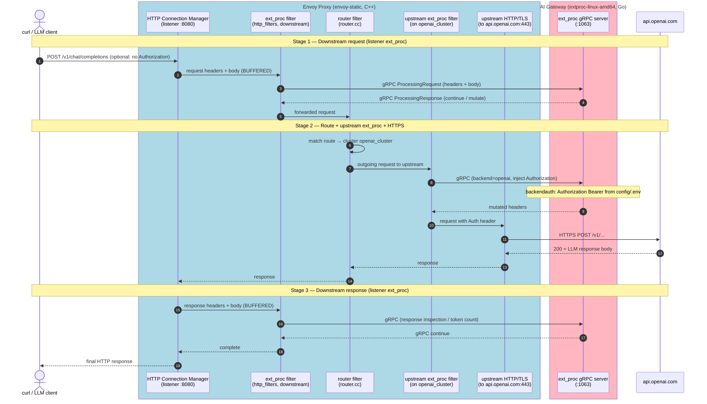

- [Envoy AI Gateway](#envoy-ai-gateway-go)
    - [What is Envoy AI Gateway / ExtProc / Controller](#what-is-envoy-ai-gateway--extproc--controller)
    - [Why AI Gateway if Envoy already proxies?](#why-ai-gateway-if-envoy-already-proxies)
    - [Architecture](#architecture)
    - [Clone, Build, Run](#clone-build-run)
        - [Clone & build](#clone--build)
        - [Configuration files](#configuration-files)
            - [extproc config (`config/extproc.yaml.template`)](#extproc-config-configextprocyamltemplate)
            - [`config/envoy.yaml`](#configenvoyyaml---connecting-envoy-to-ai-gateway)
    - [Connect AI Gateway with Envoy Proxy](#connect-ai-gateway-with-envoy-proxy)


# Envoy AI Gateway (Go)
> Source: https://github.com/envoyproxy/ai-gateway  
> Docs: https://aigateway.envoyproxy.io/


## What is Envoy AI Gateway / ExtProc / Controller 
- This is an extension project built on top of Envoy Gateway. 
- It introduces an External Processor (ExtProc) component and a specialized AI Gateway Controller. 
- `extproc-linux-amd64` is the **External Processor (ext_proc) gRPC server** the core of AI Gateway for standalone mode.
- The full AI Gateway project also has a **Kubernetes controller** (not used in this lab).

## Why AI Gateway if Envoy already proxies?

Phase 1 Envoy alone = dumb reverse proxy (forward HTTP + TLS + access logs).

| Capability | Plain Envoy | + AI Gateway ext_proc |
|------------|-------------|------------------------|
| Parse prompt/response body | No | Yes (BUFFERED mode) |
| Count tokens | No | Yes (`internal/tokenbucket/`) |
| Inject API key at proxy | No | Yes (`internal/backendauth/`) |
| Model routing / budgets | Manual YAML only | AI-aware policies |

## Architecture
```text
  Agent / curl
       |
       |  HTTP
       v
+---------------------------+
|  Envoy Proxy  :8080    admin :9901
|  (envoy-static)           |
|                           |
|  1. ext_proc filter ------+------ gRPC ----> +---------------------------+
|     (calls AI Gateway)    |                  |  AI Gateway ext_proc      |
|                           |                  |  (extproc-linux-amd64)    |
|  2. router filter         |                  |  gRPC :1063  admin :1064  |
|                           |<-- response----- |                           |
|  3. openai_cluster -------+                  |  - read prompt/body       |
|     HTTPS to OpenAI       |                  |  - inject API key header  |
+-------------|-------------+                  |  - count tokens           |
              |                                +---------------------------+
              | HTTPS (TLS)
              v
      api.openai.com:443
```
- AI Gateway receives request data from Envoy over gRPC, may add headers (e.g. `Authorization`), and sends the modified request back to Envoy. Envoy then forwards to `api.openai.com`.

**Per-request flow:**

1. curl/agent → `http://127.0.0.1:8080/v1/...`
2. Envoy **listener** ext_proc filter → gRPC to AI Gateway `:1063` (BUFFERED body)
3. AI Gateway processes request, returns mutated headers (e.g. adds `Authorization: Bearer ...`)
4. Envoy **router** → `openai_cluster` → upstream ext_proc (inject key at cluster level) → **HTTPS to OpenAI**
5. Response travels back; Envoy ext_proc may inspect response body (token count)

## Clone, Build, Run

### Clone & build

```bash
git clone --depth 1 https://github.com/envoyproxy/ai-gateway.git ai-gateway
cd ai-gateway

make build.extproc

$ ls -ltr out/
-rwxr-xr-x 1 amit amit 86238692 Aug  5 17:12 extproc-linux-amd64
$ chmod +x /home/amit/ProtocolNine/scripts/extproc.sh 
```

### Configuration files

| File | Purpose |
|------|---------|
| `config/extproc.yaml.template` | AI Gateway backend config (OpenAI + placeholder key) |
| `config/extproc.runtime.yaml` | Generated at start — key from `config/.env` (gitignore this) |
| `config/envoy.yaml` | Envoy listener + `extproc_cluster` + `openai_cluster` |
| `config/.env` | `OPENAI_API_KEY=sk-...` (never commit) |


#### extproc config (`config/extproc.yaml.template`)

```yaml
version: dev
backends:
  - name: openai
    schema:
      name: OpenAI
      prefix: v1
    auth:
      apiKey:
        key: "__OPENAI_API_KEY__"
```

`scripts/extproc.sh` replaces `__OPENAI_API_KEY__` from `config/.env` at startup.

####  `config/envoy.yaml`  // Connecting Envoy to AI Gateway

**1. Listener ext_proc filter** (before router) — calls AI Gateway for every client request:

```yaml
http_filters:
- name: envoy.filters.http.ext_proc
  typed_config:
    "@type": type.googleapis.com/envoy.extensions.filters.http.ext_proc.v3.ExternalProcessor
    processing_mode:
      request_body_mode: BUFFERED    # needed for token counting
      response_body_mode: BUFFERED
    grpc_service:
      envoy_grpc:
        cluster_name: extproc_cluster
- name: envoy.filters.http.router
```

**2. extproc_cluster** — points to AI Gateway gRPC server:

```yaml
- name: extproc_cluster
  load_assignment:
    endpoints:
    - lb_endpoints:
      - endpoint:
          address:
            socket_address:
              address: 127.0.0.1
              port_value: 1063
```

**3. openai_cluster** — upstream to OpenAI + metadata so ext_proc knows backend name `openai`:

```yaml
- name: openai_cluster
  # ... TLS sni: api.openai.com ...
  load_assignment:
    endpoints:
    - lb_endpoints:
      - endpoint:
          address:
            socket_address:
              address: api.openai.com
              port_value: 443
        metadata:
          filter_metadata:
            aigateway.envoy.io:
              per_route_rule_backend_name: openai
```

Full file: `config/envoy.yaml`


## Flow Diagram


**Goal:** Agent/curl does **not** need the real OpenAI API key. The key lives only in `config/.env` on the gateway.

**Flow:**

```text
curl (NO Authorization header)
  → Envoy :8080
  → ext_proc gRPC → AI Gateway reads key from config/extproc.runtime.yaml
  → AI Gateway adds:  Authorization: Bearer <key from .env>
  → Envoy forwards to api.openai.com WITH that header
  → OpenAI accepts the request
```

## Connect AI Gateway with Envoy Proxy

Start **AI Gateway first**, then **restart Envoy** (Envoy must reach gRPC on 1063):

```bash
cd ~/ProtocolNine

# 1. Start AI Gateway ext_proc (reads config/.env for API key)
chmod +x scripts/extproc.sh scripts/envoy.sh
scripts/extproc.sh start
scripts/extproc.sh status          # expect: healthy (admin :1064)

# 2. Restart Envoy with updated config (ext_proc filter wired)
scripts/envoy.sh restart
scripts/envoy.sh status            # expect: LIVE ready (admin :9901)

# 3. Confirm extproc_cluster is up
$ curl -s http://127.0.0.1:9901/clusters | grep extproc
extproc_cluster::observability_name::extproc_cluster
extproc_cluster::default_priority::max_connections::1024
extproc_cluster::default_priority::max_pending_requests::1024
extproc_cluster::default_priority::max_requests::1024
extproc_cluster::default_priority::max_retries::3
extproc_cluster::high_priority::max_connections::1024
extproc_cluster::high_priority::max_pending_requests::1024
extproc_cluster::high_priority::max_requests::1024
extproc_cluster::high_priority::max_retries::3
extproc_cluster::added_via_api::false
extproc_cluster::127.0.0.1:1063::cx_active::0
extproc_cluster::127.0.0.1:1063::cx_connect_fail::0
extproc_cluster::127.0.0.1:1063::cx_total::0
extproc_cluster::127.0.0.1:1063::rq_active::0
extproc_cluster::127.0.0.1:1063::rq_error::0
extproc_cluster::127.0.0.1:1063::rq_pending_active::0
extproc_cluster::127.0.0.1:1063::rq_success::0
extproc_cluster::127.0.0.1:1063::rq_timeout::0
extproc_cluster::127.0.0.1:1063::rq_total::0
extproc_cluster::127.0.0.1:1063::hostname::
extproc_cluster::127.0.0.1:1063::health_flags::healthy
extproc_cluster::127.0.0.1:1063::weight::1
extproc_cluster::127.0.0.1:1063::region::
extproc_cluster::127.0.0.1:1063::zone::
extproc_cluster::127.0.0.1:1063::sub_zone::
extproc_cluster::127.0.0.1:1063::canary::false
extproc_cluster::127.0.0.1:1063::priority::0
extproc_cluster::127.0.0.1:1063::success_rate::-1
extproc_cluster::127.0.0.1:1063::local_origin_success_rate::-1

$ curl -s http://127.0.0.1:9901/ready
LIVE
```
**Stop order** (reverse): `scripts/envoy.sh stop` then `scripts/extproc.sh stop`

## Test LLM request

### Prove ext_proc is invoked (stats)

```bash
curl -s http://127.0.0.1:9901/stats | grep 'llm_ingress.ext_proc.streams_started'
# counter should increase after each request
```

### Chat completion (credential injection — no Authorization in curl)

```bash
$ curl -s http://127.0.0.1:8080/v1/chat/completions \
  -H 'Content-Type: application/json' \
  -d '{
    "model": "gpt-4o-mini",
    "messages": [{"role": "user", "content": "Say hi in one word"}],
    "max_tokens": 10
  }'

{
    "error": {
        "message": "You have no credits remaining. Add credits to continue using the API at https://platform.openai.com/settings/organization/billing/.",
        "type": "insufficient_quota",
        "param": null,
        "code": "credit_balance_exhausted"
    }
}
```

### Check logs
```bash
$ tail -f logs/extproc.log
time=2026-08-06T16:45:42.764+05:30 level=INFO msg="Registering processor" path=/v1/images/generations
time=2026-08-06T16:45:42.764+05:30 level=INFO msg="Registering processor" path=/cohere/v2/rerank
time=2026-08-06T16:45:42.764+05:30 level=INFO msg="Registering processor" path=/v1/models
time=2026-08-06T16:45:42.764+05:30 level=INFO msg="Registering processor" path=/anthropic/v1/models
time=2026-08-06T16:45:42.764+05:30 level=INFO msg="Registering processor" path=/anthropic/v1/messages
time=2026-08-06T16:45:42.764+05:30 level=INFO msg="Registering processor" path=/tokenize
time=2026-08-06T16:45:42.764+05:30 level=INFO msg="loading a new config" path=/home/amit/ProtocolNine/config/extproc.runtime.yaml
time=2026-08-06T16:45:42.764+05:30 level=INFO msg="start watching the config file" path=/home/amit/ProtocolNine/config/extproc.runtime.yaml interval=5s
AI Gateway External Processor is ready
time=2026-08-06T16:45:42.766+05:30 level=INFO msg="starting admin server" address=[::]:1064

$ tail -f logs/envoy-access.log
[2026-08-05T08:20:21.155Z] cluster=openai_cluster host=162.159.140.245:443 method=GET path=/v1/models authority=api.openai.com status=200 req_bytes=0 resp_bytes=14995 duration_ms=808 upstream_ms=802 request_id=78c77456-0bd1-44ba-89a3-f463b9ca6b74
[2026-08-05T08:31:11.681Z] cluster=openai_cluster host=172.66.0.243:443 method=GET path=/v1/models authority=api.openai.com status=200 req_bytes=0 resp_bytes=14995 duration_ms=818 upstream_ms=813 request_id=2a54030d-036b-41ed-a61c-80678b34fb5d
[2026-08-05T11:43:40.265Z] cluster=openai_cluster host=- method=GET path=/v1/models authority=127.0.0.1:8080 status=200 req_bytes=0 resp_bytes=27 duration_ms=78 upstream_ms=- request_id=522ada42-41f7-43d2-87be-3a510386e3b0
[2026-08-05T11:43:47.071Z] cluster=openai_cluster host=162.159.140.245:443 method=POST path=/v1/chat/completions authority=api.openai.com status=429 req_bytes=86 resp_bytes=283 duration_ms=1477 upstream_ms=1368 request_id=6817fa97-581f-47c5-81a7-40f0518ce3c8
[2026-08-06T11:17:40.994Z] cluster=openai_cluster host=172.66.0.243:443 method=POST path=/v1/chat/completions authority=api.openai.com status=429 req_bytes=123 resp_bytes=283 duration_ms=1693 upstream_ms=1642 request_id=7dc12e7c-f71e-41be-a450-f3a7a6ed7310
```


## Key source dirs

| Path | What |
|------|------|
| `internal/extproc/` | gRPC server entry |
| `internal/tokenbucket/` | token budgets |
| `internal/backendauth/api_key.go` | API key injection |
| `filterapi/` | shared config types |
| `tests/data-plane/envoy.yaml` | reference ext_proc wiring |
