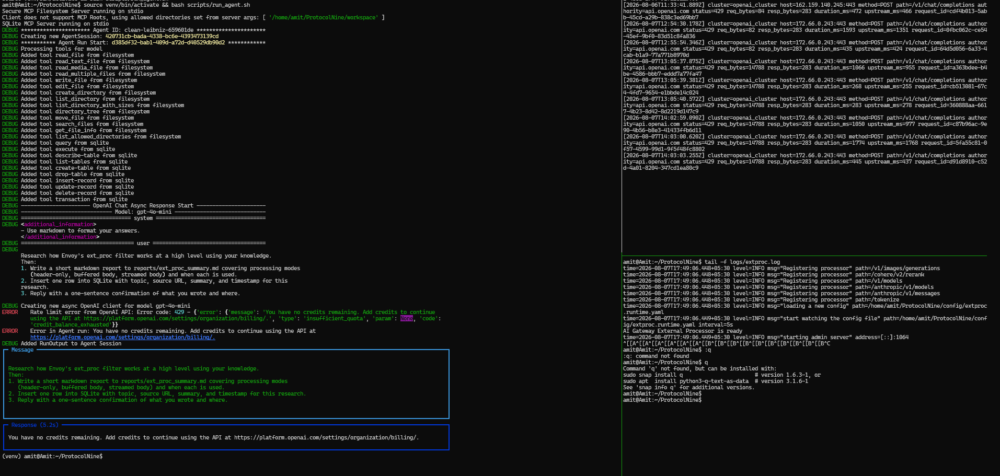
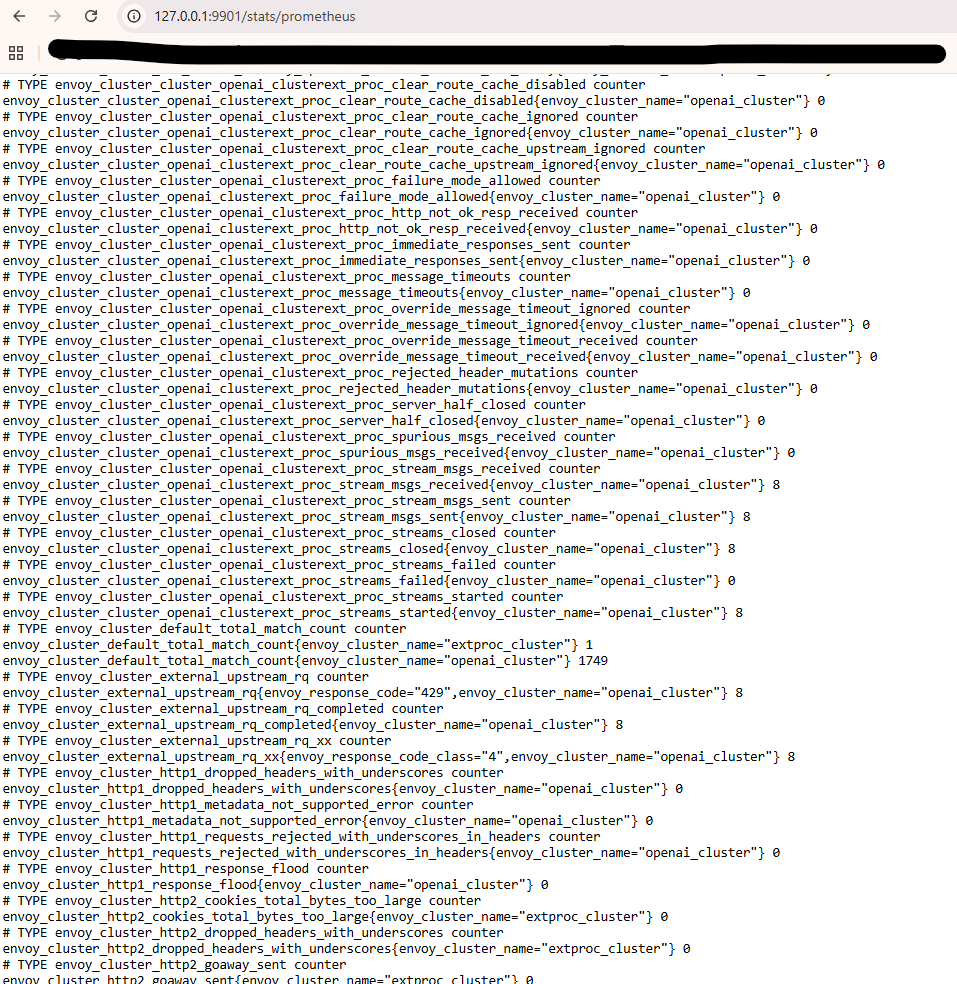
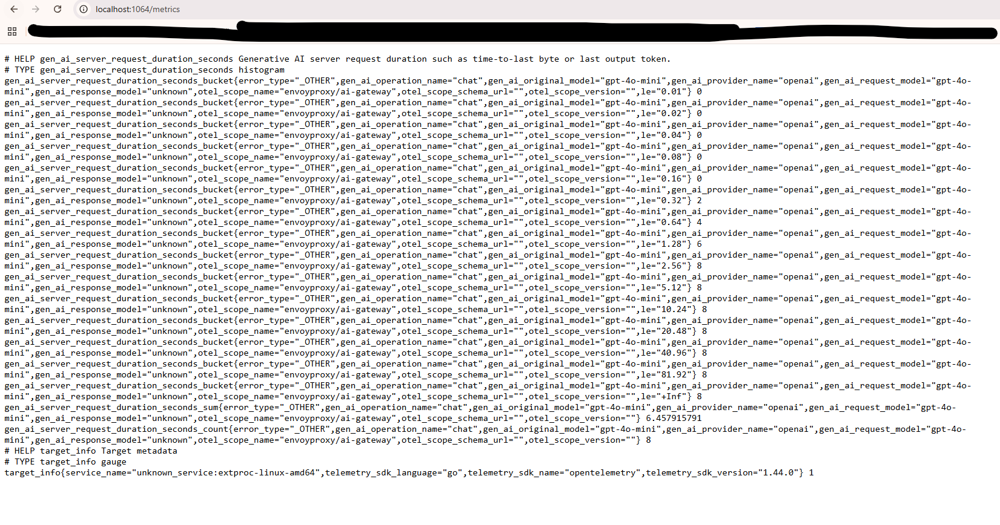
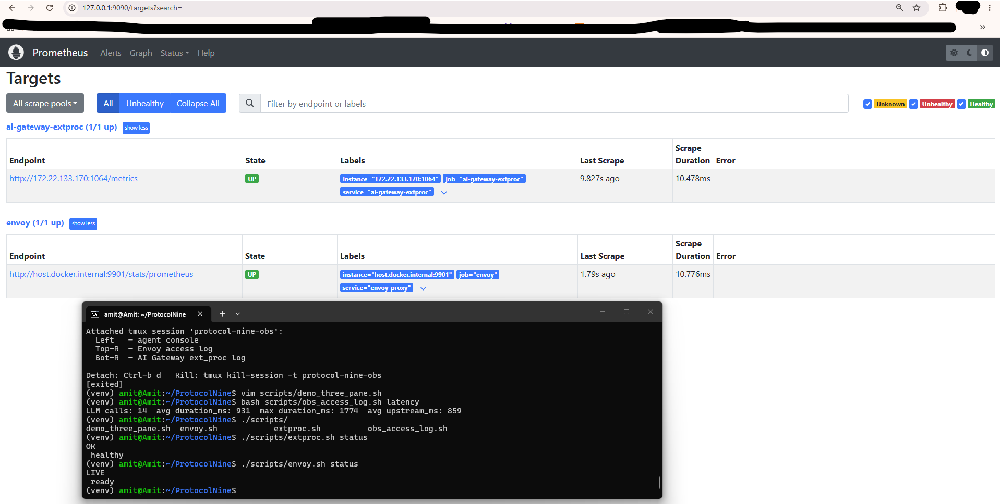
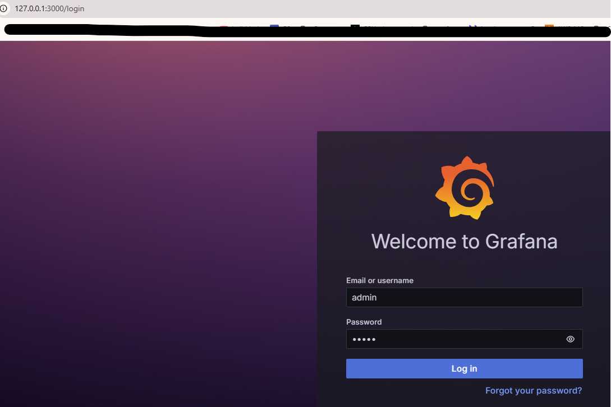
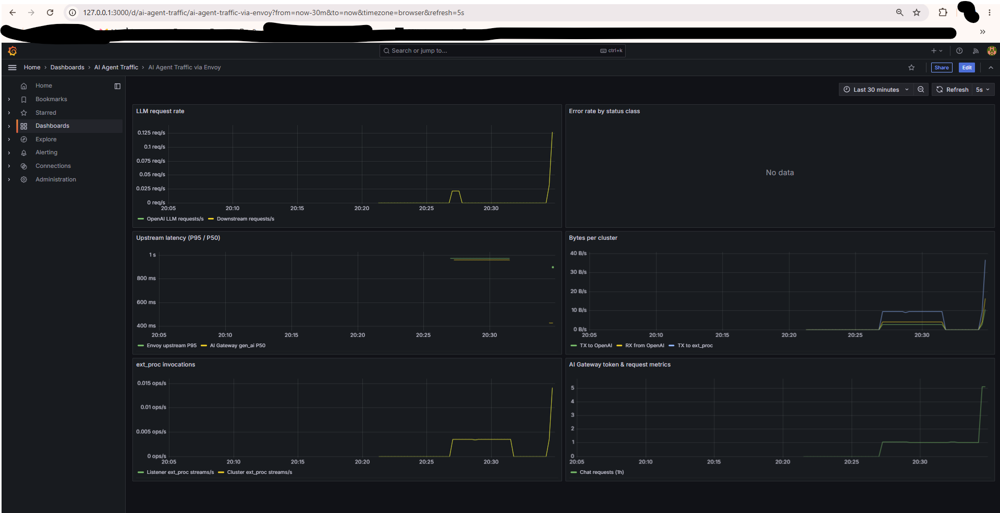

- [Observability — Phase 4](#observability--phase-4)
  - [1. Access Log](#1-access-log)
    - [1.1 Log](#11-log)
    - [1.2 Simultaneous looking into logs (3 pane demo)](#12-simultaneous-looking-into-logs-3-pane-demo)
    - [1.3 Helper script](#13-helper-script)
  - [2. Prometheus scrape](#2-prometheus-scrape)
    - [2.1 Envoy stats](#21-envoy-stats)
    - [2.2 AI Gateway metrics](#22-ai-gateway-metrics)
  - [3. Grafana ≥ 5 metrics](#3-grafana--5-metrics)
    - [Prometheus Targets (envoy, AI Gateway)](#prometheus-targets-envoy-ai-gateway)
    - [Grafanna Dashboard](#grafanna-dashboard)
      - [Panel](#panel)
        - [LLM request rate](#llm-request-rate)
        - [Upstream latency (P95 / P50)](#upstream-latency-p95--p50)
        - [ext_proc invocations](#ext_proc-invocations)
        - [Bytes per cluster](#bytes-per-cluster)
        - [AI Gateway token & request metrics](#ai-gateway-token--request-metrics)
        - [Error rate by status class (No data)](#error-rate-by-status-class-no-data)
  - [Interview Q&A examples](#interview-qa-examples)
    - [Body sizes for LLM vs MCP?](#body-sizes-for-llm-vs-mcp)
    - [Latency distribution?](#latency-distribution)
    - [Failures?](#failures)
  - [Runbook](#runbook)


# Observability — Phase 4

This is done using 3 methods:

1. Access log analysis
2. Prometheus scraping
3. Grafana dashboard with six panels

## 1. Access Log
### 1.1 Log
```bash
 ./scripts/obs_access_log.sh
=== Access log: /home/amit/ProtocolNine/logs/envoy-access.log ===
Total lines: 14

-- By status --
     11 429
      3 200

-- LLM chat/completions --
11

-- Top upstream hosts --
      8 172.66.0.243:443
      5 162.159.140.245:443
      1 -
```

### 1.2 Simultaneous looking into logs (3 pane demo)
```text
+------------------+------------------+
|                  |  tail access log |
|   run_agent.sh   +------------------+
|                  |  tail extproc    |
+------------------+------------------+
```

```bash
$ scripts/demo_three_pane.sh
  (1) Agent console          python agent/run_task.py
         |
         |  LLM HTTP
         v
  (2) Envoy access log       logs/envoy-access.log
         |
         |  gRPC ext_proc
         v
  (3) AI Gateway log         logs/extproc.log  (+ /metrics for tokens)
exit
exit
exit
```



### 1.3 Helper script

```bash
bash scripts/obs_access_log.sh summary      # rollup
bash scripts/obs_access_log.sh llm-only     # chat/completions only
bash scripts/obs_access_log.sh by-host      # upstream host frequency
bash scripts/obs_access_log.sh by-status    # status code counts
bash scripts/obs_access_log.sh body-sizes   # avg/max bytes for LLM calls
bash scripts/obs_access_log.sh latency      # duration_ms for LLM calls
bash scripts/obs_access_log.sh failures     # non-2xx lines
bash scripts/obs_access_log.sh tail-live    # follow during agent run
```


## 2. Prometheus scrape
### 2.1 Envoy stats
`observability/prometheus/prometheus.yml`
```text
http://127.0.0.1:9901/stats/prometheus | `envoy_cluster_*`, `envoy_http_ext_proc_*` |
```



### 2.2 AI Gateway metrics
```text
http://localhost:1064/metrics
```



## 3. Grafana ≥ 5 metrics 
> Dashboard file: `observability/grafana/dashboards/ai-agent-traffic.json`

- Grafana, Prometheus runs as 2 docker containers, scraping from [Envoy(`:9901`) and AI Gateway(`:1064`) running on Ubuntu WSL]

**Using Docker Compose on Windows (Prometheus + Grafana together)**

- 2 Docker containers (Prometheus and Grafana)
```bash
cd ~/ProtocolNine
./scripts/envoy.sh start
./scripts/extproc.sh start
bash scripts/observability.sh stop
bash scripts/observability.sh start-docker
bash scripts/observability.sh stop-docker
```

```text
|-------- Docker Desktop ---------|       |------- Ubuntu WSL -----|
| Prometheus(http://127.0.0.1:9090) <---scrape---  Envoy           |
|      |                          |       |                        |
|      |show on dashboard         |       |                        |
|     \/                          |       |   AI Gateway           |
| Grafanna(http://127.0.0.1:3000) |       |                        |
|---------------------------------|       |------------------------|
```

### Prometheus Targets (envoy, AI Gateway) 
```bash
http://127.0.0.1:9090/targets

If `ai-gateway-extproc` is **DOWN** with `connection refused` on `host.docker.internal:1064` (extproc healthy locally), re-run:

bash scripts/observability.sh stop-docker
bash scripts/observability.sh start-docker
```


### Grafanna Dashboard
- Generate traffic so graphs move:
```bash
curl -s http://127.0.0.1:8080/v1/chat/completions \
  -H 'Content-Type: application/json' \
  -d '{"model":"gpt-4o-mini","messages":[{"role":"user","content":"hi"}],"max_tokens":1}'
```





Login > Dashboards > AI Agent Traffic > AI Agent Traffic via Envoy

#### Panel
##### LLM request rate 
- How many HTTP requests per second are hitting the LLM path
- OpenAI LLM requests/s (source envoy): Requests forwarded to openai_cluster (actual calls toward api.openai.com)
- Downstream requests/s (source envoy): All HTTP requests arriving on listener :8080 (llm_ingress)

#####  Upstream latency (P95 / P50)
How long LLM calls take — but this panel mixes two different systems and two different percentiles.

**Envoy upstream P95 (Source: Envoy:9091)**

- Time for requests on openai_cluster: Envoy → TLS → OpenAI → response back (includes network + OpenAI + ext_proc at cluster)

**AI Gateway gen_ai P50 (Source: AI Gateway :1064)**

- AI Gateway’s OpenTelemetry “server request duration” for chat — measured inside ext_proc for the LLM operation

##### ext_proc invocations
- How often Envoy calls AI Gateway over gRPC for external processing.

|Metrics|Meaning|
|---|---|
|Listener ext_proc streams/s|Every client request/response (body inspection, token paths|
|Cluster ext_proc streams/s|Before/after talking to OpenAI (e.g. API key injection)|

##### Bytes per cluster
Data throughput (bytes per second) on Envoy upstream connections.

|Metrics|Cluster|Meaning|
|---|---|---|
|TX to OpenAI|openai_cluster|Bytes Envoy sends to OpenAI (JSON body + headers)|
|RX from OpenAI|openai_cluster|Bytes Envoy receives (JSON error or completion)|
|TX to ext_proc|extproc_cluster|Bytes over gRPC to AI Gateway (request/response bodies for inspection)|

##### AI Gateway token & request metrics
Application-level AI metrics from AI Gateway (OpenTelemetry / Prometheus on :1064).

|Line	|Metric|	Meaning|
|---|---|---|
|Input tokens/s|gen_ai_client_token_usage (input)|Prompt tokens consumed per second|
|Output tokens/s|gen_ai_client_token_usage (output)|Completion tokens per second|
|Chat requests (1h)|gen_ai_server_request_duration_seconds_count|Total chat completion requests in the last hour|

##### Error rate by status class (No data)
Failed requests per second from Envoy’s view.

|Line	|Status|
|---|---|
|429 quota/rate limit|OpenAI billing / rate limits|
|All 4xx|Any client/upstream 4xx|
|5xx|Server errors|

## Interview Q&A examples

### Body sizes for LLM vs MCP?

- LLM calls appear in the access log (`path=/v1/chat/completions`, large `req_bytes` from tool schemas). 
- Stdio MCP does **not** appear — explain that gap.

### Latency distribution?
```bash
bash scripts/obs_access_log.sh latency
LLM calls: 14  avg duration_ms: 931  max duration_ms: 1774  avg upstream_ms: 859
```

### Failures?

```bash
bash scripts/obs_access_log.sh failures
# e.g. status=429 insufficient_quota — routing OK, billing blocked
```

## Runbook

```bash
# 1. Stack
./scripts/envoy.sh start
./scripts/extproc.sh start

# 2. Metrics
bash scripts/observability.sh start

# 3. Demo
bash scripts/demo_three_pane.sh
# or run agent + tail logs in separate terminals

# 4. Log analysis
bash scripts/obs_access_log.sh summary

# 5. Tests
bash scripts/test_phase4.sh
```